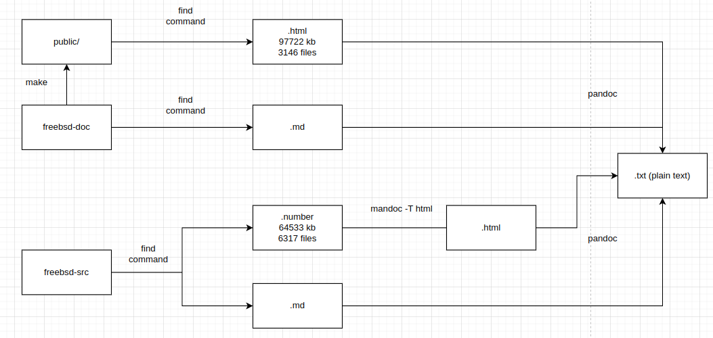

# freebsd_data

This project is aimed at providing a comprehensive guide and tools for extracting valuable data from FreeBSD documentation and man pages to fuel machine learning and deep learning initiatives.

This is the workflow of how this project extract data from freebsd src codes.


Additionally, we offer a Deep Learning (DL) implementation that generates an embedded vector database (`example/retrieve`). You can seamlessly integrate this database with ChatGPT to enhance its capabilities. It enables ChatGPT to provide contextually relevant text in response to your questions, leading to more accurate answers. Essentially, it transforms ChatGPT into an expert system specialized in the FreeBSD domain.

This DL implementation is just one example of what you can achieve. Your creativity is the limit, allowing you to explore various other implementations and applications.

## Installation

This project makes use of specialized tools tailored for FreeBSD OS, including 'mandoc' for rendering man pages. As a result, running the script on a FreeBSD OS is recommended to ensure compatibility and smooth operation.

## Usage

Run `data.sh` directly.
```
$ sh data.sh
```

## GPTs
In November 2023, OpenAI introduced GPTs, a specialized version of ChatGPT. You can upload data here to establish your personalized expert system tailored to the domain of FreeBSD.

## Contributing

Pull requests are welcome. For major changes, please open an issue first to discuss what you would like to change.

Please make sure to update tests as appropriate.

## License

[MIT](https://choosealicense.com/licenses/mit/)